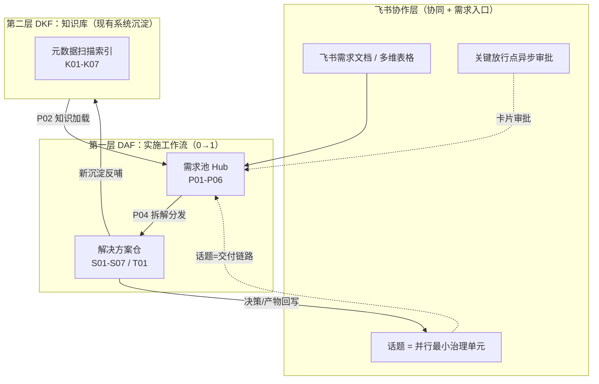

# D365 AI 规范化交付范式

> **设计蓝本**：小米 AI Coding 三层工程体系（VAF 工作流 + VKF 知识库 + eight-claw 协作）
> **适配对象**：Dynamics 365 CE + Power Platform，几人规模的实施/交付小团队
> **三层产物命名建议**：`DAF`（Dynamics Agentic Flow，实施工作流）· `DKF`（Dynamics Knowledge Flow，知识库）· `飞书协作层`
>
> 命名刻意对齐 VAF/VKF，方便对内宣讲和对客叙事时建立认知锚点。

---

## 0. 为什么不能照搬，以及总体设计

小米那套是为 **50 万行 Java 微服务**（Dubbo 接口、MQ 消息、海量调用链）设计的。D365 的根本差异决定了三层都要重做：

| 维度 | 小米场景 | D365 场景 | 对范式的影响 |
|---|---|---|---|
| "代码"的本质 | 纯 pro-code | **元数据(solution) 为主 + 少量 pro-code** | 知识沉淀的对象主要是元数据，不是源码 |
| 核心决策 | 技术方案选型 | **Fit-Gap：标准/配置/定制/集成 四象限** | 这是 D365 特有的、必须进流程的门禁 |
| 代码库规模 | 巨大，AI 无法一次读完 | 中小，但定制散落、隐性知识多 | VKF 的"重型代码索引"要瘦身，但"显性化"诉求一样强 |
| 角色 | 研发为主 | 功能顾问 / 技术顾问 / 集成 / 测试 / PM | 协作层和放行点要支持多角色 |
| 制品 | PRD / 代码 | BRD / FDD / SDD / 配置工作簿 / 测试用例 | 工件体系要贴 D365 交付物 |
| 既有方法论 | 无强约束 | Success by Design / Sure Step | 范式要能"套"在现有方法论上，不是替换 |

**继承小米的四条原则（直接适用）**：

1. **降低门槛 > 提升上限**——决定团队能力的是 80% 的大多数顾问，不是 20% 的高手。
2. **给 AI 代码索引 > 给 AI 灌代码**——对 D365 就是：给 AI 一张"实体/流程/插件在哪"的地图，而不是把整个 solution 塞给它。
3. **并行 > 串行，过程 > 结果**——瓶颈是信息在角色间流转的损耗，不是个人速度。
4. **工具链会迭代，知识与协同才是沉淀**——pac CLI、模型、Copilot 都会换代，但知识仓里的业务资产、飞书话题里的决策记录是长期资产。

### 三层架构关系



一句话定位：**DKF 让 AI 懂你们的系统 → DAF 让交付有规范流程 → 飞书层让小团队并行协作并沉淀资产。**

---

## 1. 第一层 DAF — 实施工作流（0→1）

把 VAF 的 **KPST 四阶段 + 阶段门禁 + 人工放行 + Git 即状态** 翻译到 D365 实施生命周期。

### 1.1 阶段模型（KPST → D365）

| 阶段 | VAF 原义 | D365 含义 | 在哪执行 |
|---|---|---|---|
| **K** Knowledge | 知识前置 | 加载 D365 标准能力 + DKF 既有系统知识 + 行业模板 | 由 DKF（第二层）供给 |
| **P** Planning | 需求分析 | 需求采集 → Fit-Gap → FDD → 方案拆解 → SDD | **需求池 Hub** |
| **S** Solution | 开发实现 | 详设 → 任务拆解 → 配置/编码 → 测试 → 评审 → 打包部署 | **解决方案仓** |
| **T** Testing | E2E 测试 | 端到端业务流程 / UAT | 解决方案仓 |

### 1.2 仓库与制品体系（映射 VAF 四仓）

| 仓类型 | VAF 对应 | 定位 | 主要负责人 | 执行阶段 |
|---|---|---|---|---|
| **范式源码仓** | VAF 源码仓 | 提供模板、prompts、pac 脚本、Skill 定义 | 范式维护者 | — |
| **需求池 Hub** | 需求池 Hub | 需求与方案设计中心；多人共用一个 | 功能顾问 / 架构师 / PM | P01–P06 |
| **知识仓** | 知识仓 | DKF 产出的元数据知识索引 | 架构师 / 技术顾问 | P02 引用 |
| **解决方案仓** | 服务代码仓 | 各 solution 的 source-controlled 形态 + 配置工作簿 + pro-code | 技术顾问 / 开发 | S01–S07 / T01 |

> **VAF 的 `manifest_local.json` → D365 的 `stream-mapping.json`**：声明哪些 solution 组件归哪个交付流/仓，`hub_path` 指向需求池。本地映射文件，进 `.gitignore`，不提交。

### 1.3 P 阶段详解（需求池 Hub 内执行）

| 步骤 | 名称 | 输入 → 产物 | D365 要点 |
|---|---|---|---|
| **P01** | 需求采集 | 飞书需求文档 / BRD → 结构化需求清单 | 每条需求带 ID、模块、验收标准 |
| **P02** | 知识加载 | 引用 DKF 知识仓 + D365 标准能力 + 行业模板 | 让 AI 知道"标准已经能做什么" |
| **P03** | Fit-Gap & FDD 评审 | 逐条需求做 **标准/配置/定制/集成** 四象限决策 → FDD | **D365 核心门禁**，决策必须人工放行 |
| **P04** | 方案拆解 | 拆成交付流：配置流 / pro-code 流 / 集成流 / 数据迁移流 / 报表流 | 对应 VAF 的"服务拆解" |
| **P05** | 概要设计 SDD | 数据模型 + 安全模型(BU/Team/Role) + 集成架构 + 环境策略 | 决定后续所有 solution 的边界 |
| **P06** | 协调中心 | 多流门禁：各流就绪 → 汇合评审 → 通过后分发 | 仅多流并行时启用（对应 VAF 多服务模式 P06-A/B/C 门禁） |

### 1.4 S / T 阶段详解（解决方案仓内执行）

| 步骤 | 名称 | D365 产物 |
|---|---|---|
| **S01** | 详细设计 | 实体 schema（字段/关系/键）、表单/视图、BPF、business rules、安全角色矩阵；pro-code 接口设计 |
| **S02** | 任务拆解 | 区分 配置任务 / 开发任务 / 集成任务 |
| **S03** | 配置 & 编码实现 | 在 dev 环境配置 + 写 plugin / PCF / Power Automate；产物 = unmanaged solution + 配置工作簿 + pro-code 源码 |
| **S04** | 单元/组件测试 | 插件单测（FakeXrmEasy）、flow 测试、PCF 测试 |
| **S05** | 集成计划 | Dataverse API / custom connector / virtual table / 数据迁移字段映射 |
| **S06** | 评审门禁 | **Solution Checker（自动）** + 配置审查 + code review + ALM 检查 |
| **S07** | 打包部署 | `pac solution export`（managed）→ 部署到 UAT/集成环境 |
| **T01** | E2E / UAT | 按业务流程跑通 → 测试报告 + 缺陷回流 |

### 1.5 门禁、放行与"Git 即状态"

- **阶段门控**：P01 未放行，P02 锁定；多流并行后在 P06 汇合（完全沿用 VAF 状态机）。
- **状态机**：`locked🔒 → unlocked → executing → pending_review → approved`。
- **人工放行点**：功能顾问/架构师审核，`yes` 放行 / `e` 与 AI 继续修改。Fit-Gap（P03）、SDD（P05）、UAT（T01）是强制人工节点。
- **自动 Git 提交**：每阶段产物自动提交，规范 `feat(P03): Fit-Gap & FDD [DAF]`。
- **统一入口**：对齐 VAF 的 `@vaf_starter.md`，做一个 `@daf_starter.md`，渲染菜单、阶段门控、自动 pull 最新 solution。

### 1.6 工具落地（全部用现成的，不自建 runtime）

| 能力 | 工具 |
|---|---|
| solution 源码化 | `pac solution clone / unpack / pack` + Git |
| managed 打包导出 | `pac solution export --managed` |
| ALM 跨环境部署 | Azure DevOps Pipelines（build → export → import） |
| 质量门禁 | Solution Checker（接入 S06） |
| 环境 | dev → test(UAT) → prod 三环境 |
| AI 执行引擎 | Claude Code / Copilot / Codex（对齐 eight-claw 的多引擎抽象，但小团队选一个即可） |

> **刻意取舍（学小米）**：不造新 runtime、不造新 orchestrator。把精力放在 D365 最稀缺的部分——Fit-Gap 决策模板、配置工作簿规范、ALM 自动化、知识索引。

---

## 2. 第二层 DKF — 现有系统知识库沉淀

VKF 的核心教训是：**v1.0 把代码翻译成静态知识文档失败了**——"层层翻译"会丢条件、弱化边界、误读调用关系；v2.0 重新定位为**代码索引**（告诉 AI 从哪看、走哪条链、哪些接口相关），逻辑判断回到代码本身。

**这条教训对 D365 更成立**：solution 元数据（实体定义、插件注册步骤、flow 定义）本身就是 source of truth，AI 应该被索引导航到具体定义，而不是去读一份被人转述的"模块说明"。

### 2.1 D365 的"代码"是什么（扫描对象）

| 类别 | 具体内容 |
|---|---|
| **元数据（主体）** | 实体/字段/关系/键、表单/视图、BPF、business rules、Power Automate flows、classic workflows、安全角色、SLA、queue、路由规则 |
| **pro-code** | plugin（C#，注册在哪个 message/entity/stage）、PCF（TypeScript）、JS web resources、custom API、custom connector、virtual table |
| **配置** | 环境变量、连接引用、SLA、Omnichannel 配置 |

### 2.2 K-pipeline 适配（映射 VKF K01–K07）

| 步骤 | VKF 原义 | D365 含义 | 人工关注 | 缺失影响 |
|---|---|---|---|---|
| **K01** | 元数据扫描 | 用 Dataverse Web API / Metadata API / pac 导出，扫出实体清单、安全模型、业务流程、集成入口、pro-code 清单 → 产出 `meta/` | 否（自动） | 整库地图缺失 |
| **K02** | 业务领域划分 | 把实体/流程按 D365 模块 + 自定义模块划分领域（DDD 界限上下文） | ✅ 是 | 领域不准 |
| **K03** | 边界确认 | 人工审核领域归属，处理 unclassified 的共享/自定义组件 | ✅ 是 | 归属错乱 |
| **K04** | 领域知识生成 | 每个「领域 + solution」组合生成 Skill 文档（实体、关键流程、安全、集成、坑点）；N 域 × M solution | ✅ 是 | 域知识缺 |
| **K05** | 跨模块文档 | 跨域业务链路（如 Lead→Opp→Quote→Order 跨 Sales+自定义），仅 ≥2 solution 涉及时 | ✅ 是 | 跨模块断 |
| **K06** | 解决方案元信息 | 每个 solution 的架构/技术栈(plugin/PCF 版本/依赖)、配置清单、环境信息 | 部分 | 导航缺 |
| **K07** | AI 索引 | 汇总成可检索索引 | 否 | 检索失效 |

> **K01 的 D365 产物（对应 VKF 的 service-meta/）**示例：
> `K01_A` 业务入口（plugin steps / custom API / flow triggers）· `K01_B` 外部依赖（connectors / 集成）· `K01_C` 实体关系拓扑 · `K01_E` OptionSet / 全局枚举 · `K01_H` 表单-字段映射。

### 2.3 知识库仓结构

```text
dkf-knowledge/                # 对应 VKF 的 vibe-vectore-knowledge 仓
├── .dkf/
│   ├── meta/                 # K01 扫描产物（实体/安全/流程/集成 元数据）
│   ├── domains/             # K02-K03 领域划分与边界
│   ├── skills/              # K04 领域知识 Skill（每域一份）
│   ├── cross/               # K05 跨模块链路
│   ├── solutions/           # K06 solution 元信息
│   └── index/               # K07 检索索引
└── VERSION
```

**关键原则**：`meta/` 和 `index/` 指向真实元数据/代码位置（哪个实体、哪个 plugin step、哪个 flow），不替元数据做二次表达。AI 拿到的是"导航 + 检索"，最终判断回 solution。

---

## 3. 第三层 飞书协作层 — 小团队 + 需求文档沉淀

VAF 文档原生支持飞书（`larkkit`、"有完整需求文档(飞书/本地 MD)"是其推荐场景），所以这层是顺接，不是硬造。借用 eight-claw 的核心抽象——**话题 = 并行推进的最小治理单元**——但按几人小团队大幅简化。

### 3.1 飞书需求文档 → P01 解析

- 输入源：飞书**需求文档** / **多维表格**。
- 解析：通过飞书开放平台 API 拉取文档，或人工导出 Markdown → 结构化为需求清单（每条带 ID、模块、验收标准）→ 进需求池 Hub 的 P01。
- 价值：把"售前需求文档 → 实施 FDD"这段**信息损耗最大**的环节标准化。

### 3.2 话题 = 并行最小治理单元（小团队版）

- 每个 **模块/需求** 在飞书群里开一个话题（thread），一个话题 = 一条独立交付链路，拥有自己的：**上下文 / 参与者 / 决策边界 / 状态**（eight-claw 的四个边界）。
- 小团队几个人：**一个工作台群 + 每模块一个话题** 就够，不需要 eight-claw 的多引擎 runtime 和重型治理。
- 单人多任务也适用：一个人开多个话题并行推进不同模块。

### 3.3 异步审批 & 跨设备

- 关键放行点——**Fit-Gap 决策（P03）、SDD 评审（P05）、UAT 签核（T01）**——用飞书审批卡片完成。
- 顾问/架构师在手机上 `yes` 放行或退回，AI 随即继续；出差、开会间隙都能看进度、做决策（小米强调的"透明不被设备绑定"）。

### 3.4 项目沉淀回写

- 话题里的 **Fit-Gap 记录、评审意见、决策结论** → 自动回写到需求池 Hub 和知识仓 → 成为可复用项目资产，不随人员变动流失。
- 这正是小米"协同记录一旦沉淀就长期受益"在小团队的落地形态。

---

## 4. 落地路线（MVP → 完整）

小团队**不要一上来三层全做**。按下面顺序，每步都能独立见效：

| 阶段 | 做什么 | 为什么先做 |
|---|---|---|
| **第 1 步** | **Layer 2 DKF**：对现有 D365 环境跑 K01–K07 | 投入最小、见效最快；让 AI 先"懂"你们系统，是后两层的基础 |
| **第 2 步** | **Layer 1 DAF 的 P 阶段**：标准化"飞书需求 → Fit-Gap → FDD" | 售前/实施信息损耗最大处，ROI 最高 |
| **第 3 步** | **飞书协作层 + S/T 阶段**：话题协作 + solution 源码化 + ALM 自动化 | 在前两层稳定后再上协同与构建自动化 |

> **顺序背后的判断**：小米吃过亏——VAF（工作流）先推、VKF（知识库）后补，结果"流程没问题但 AI 不懂业务，产出偏差大"。他们的教训是"流程 + 知识必须双轮驱动，且知识要先行"。你直接按正确顺序走，跳过这个坑。

---

## 5. 与售前/交付资产的结合（可选）

- **对客叙事**：
  - `DKF` → 卖点是"AI 接管你现有 D365 资产"，把客户多年的定制显性化、可检索。
  - `DAF` → 包装成公司的"规范化 AI 交付方法论"，叙事类似 GitHub SpecKit，但更贴 D365。
- **可延伸的交付物**：一页选型矩阵 PPT、《我们的 AI 交付方法论》方案书章节、客户 Workshop 材料。

---

## 附：四条设计原则速记（贴墙用）

1. 降低门槛，而非提升上限。
2. 给 AI 元数据索引，而非灌 solution。
3. 并行优先、过程透明，比"让每个人更快"更提效。
4. 工具链会迭代，知识仓与飞书话题里的沉淀才是长期资产。
